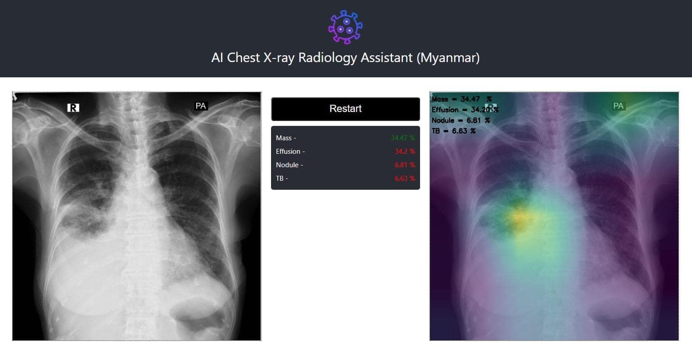

# AI_Lung_Infection_Diseases_Detection
 AI_Lung_Infection_Disease_Detection (Myanmar)
 
 
 
 1) To install Required Libraries

- (tf version: tensorflow 2.1)
- (please check conda env file (covid_environments.yml))
  
2) To install conda env file.

- conda env create -f covid_environments.yml

3) To execute the python file.

- python src/execute_xray.py --image dataset/COVID1.png

4) Web Demo URL

- https://covid-xray.netlify.app/?fbclid=IwAR1AoV3dXZOuf9nKHxm6keMBxmmZ3gApQ5vBHw4m6TxU0FLm_7am1CegLDQ 

Contributors -
Dr. Wai Yan Nyein Naing
Htut Khaung Saw Win @ John Casesar
Nyein Chan Soe Win
Hlaing Bwar

